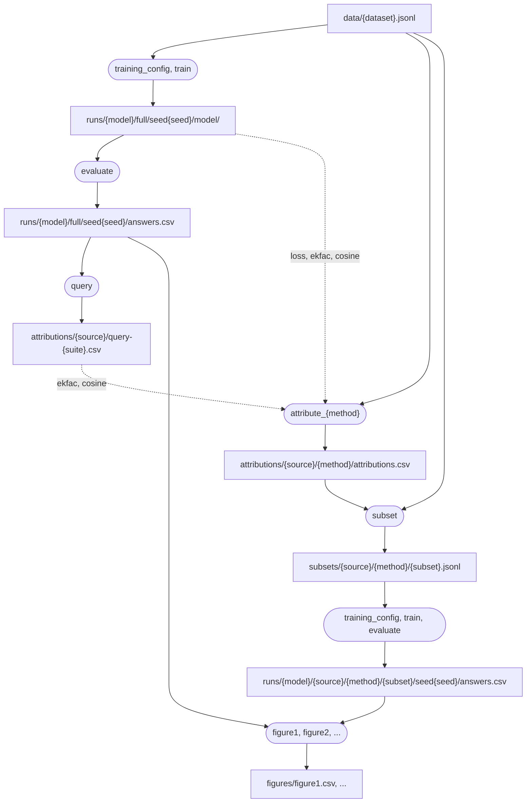

# Extending the workflow

How the Snakemake workflow is put together, and how to add a figure, an attribution method, or
another step. [README.md](../README.md) covers running it.

## Layout

The workflow follows Snakemake's
[standard layout](https://snakemake.readthedocs.io/en/stable/snakefiles/deployment.html#distribution-and-reproducibility):

| Path | What's there |
|---|---|
| `workflow/Snakefile` | Loads and validates the config, sets the `<data>` path variable, includes the rule files, and defines the `default` rule |
| `workflow/rules/common.smk` | The workflow's shared Python: settings, wildcard constraints and path helpers |
| `workflow/rules/figures/` | One file per figure, listing the runs it needs |
| `workflow/rules/figures.smk` | A target rule for each figure, and `base_models` and `smoke` |
| `workflow/rules/data.smk` | Downloading and preparing datasets, and cutting them into subsets |
| `workflow/rules/training.smk` | Training and evaluating models |
| `workflow/rules/attribution.smk` | Ranking training examples, one rule per method |
| `workflow/rules/tokens.smk` | Ranking reply tokens, and turning a ranking into a tokenized training set |
| `workflow/schemas/config.schema.yaml` | What each setting in `config/config.yaml` may be |
| `workflow/profiles/default/profile.yaml` | Command-line options every run gets (a [profile](https://snakemake.readthedocs.io/en/stable/executing/cli.html#profiles)) |
| `em_influence/` | The Python the rules run, with code only one step uses in `em_influence/scripts/` |

Everything runs in the project's single uv environment (`uv run snakemake`), so rules don't
declare [conda environments or containers](https://snakemake.readthedocs.io/en/stable/snakefiles/deployment.html#integrated-package-management).
`snakemake --lint` warns about that; about the `default` rule, which only prints a hint, having no
log; and about `figure6.smk` holding a rule as well as a function, which keeps Figure 6 in one
file. Any other warning is worth fixing.

## How the rules connect

Snakemake works backwards from the files a target asks for, finding the rule whose output
pattern matches each one and filling in its
[wildcards](https://snakemake.readthedocs.io/en/stable/snakefiles/rules.html#wildcards) from the
path. Each paper figure is one chain, drawn here with rules in rounded boxes and the files they
write in square ones:



The paths after `data/` are under `results/{dataset}/`, except `figures/`, which is directly under
`results/`. Before this, `download_archive` and `prepare_data` make `data/{dataset}.jsonl`.
bergson's methods split `attribute_{method}` in two: `ekfac` and `cosine_scores` run bergson into a
folder of their own (after `cosine_query` builds cosine's query gradient), and `attribute_ekfac`
and `attribute_cosine` export its scores. Attribution uses the baseline of the `{source}` model
trained with `reference_seed`. Token-level runs take the same shape through `tokens.smk`:
`tokenize`, then `attribute_tokens_*` and `validate_tokens_*` in place of `attribute_{method}`,
and `token_subset` (with `sample_base_tokens`, for `_sample` subsets) in place of `subset`.

Every path under `results/` is written `<results>/...`, and every downloaded dataset
`<data>/...`. These are Snakemake
[path variables](https://snakemake.readthedocs.io/en/stable/snakefiles/rules.html#path-variables):
`<results>` is built in, and the Snakefile sets `<data>`. A config file (as in
`config/smoke.yaml`) or `--config 'pathvars={results: ..., data: ...}'` can move either.

Each `{name}` in a path is a wildcard, constrained in `common.smk`. The main ones are:

| Wildcard | Meaning | Examples |
|---|---|---|
| `dataset` | Training data | `career`, `smoke` |
| `model` | The model being trained or evaluated, a key of `models` | `olmo`, `qwen3-8b` |
| `source` | The model whose baseline ranked the data | `olmo` |
| `method` | Attribution method, with `@<suite>` for a partial query | `ekfac`, `cosine@safety_and_harm`, `rubric-wrongness` |
| `subset` | Which rows of the ranking to train on | `remove_top_0.2`, `select_bottom_0.05_resampled`, `decile_3` |
| `trained_on` | `full`, `untrained` (the model before fine-tuning), or `{source}/{method}/{subset}` for a retrain | `olmo/ekfac/remove_top_0.2` |
| `seed` | Training seed | `0` |
| `suite` | The questions an attribution query uses: `all`, or a list under `templates/cross_eval/` | `all`, `safety_and_harm` |

The attribution rules write the same output pattern (`attribute_rubric` spells out its
`rubric-{metric}`) and claim their methods with `wildcard_constraints`, so the method name in a
path picks the rule. `em_influence/selection.py` parses subset names.

## Adding a figure

Each figure is a file in `workflow/rules/figures/`, holding a function that lists the judged
answers the figure needs from one dataset. The workflow makes a target rule for it that collects
them across `config["datasets"]` and tabulates each run's misaligned-answer rate, overall and per
question category, and `<figure>_narrow` and `<figure>_loss` targets for the same runs.

1. Write `workflow/rules/figures/<name>.smk`. `@figure` names the target and gives the
   description `snakemake --list-target-rules` shows. The helpers in `common.smk` build the
   paths: `baseline(dataset)` is the reference model's baseline runs, `retrained(dataset,
   methods, subsets)` the retrains on each subset of each method's ranking (pass `source=` and
   `model=` to rank with or retrain a different model), and `extremes("remove")` the
   `remove_{top,bottom}_{fraction}` subset names for every configured fraction. `baseline` and
   `retrained` return one path per seed.

   ```python
   @figure("loss_deciles", "Train on each decile of the reference model's loss.")
   def loss_deciles_runs(dataset):
       return baseline(dataset) + retrained(dataset, ["loss"], DECILES)
   ```

   For a different table, add a rule of its own to the file, as `figure6.smk` does for
   `figure6_spearman`.

2. Add it to the table in the README, and to the `smoke` rule's list in `figures.smk` if it runs
   a step the smoke run doesn't already cover.

3. `uv run snakemake loss_deciles -n` lists the jobs it needs, and `uv run pytest` checks that
   every target, this one included, still plans and is formatted.

If a new setting controls the figure, add it to `config/config.yaml` and to the schema's
`properties` and `required` lists, or validation will reject it.

## Adding an attribution method

Add a rule to `workflow/rules/attribution.smk` that writes
`<results>/{dataset}/attributions/{source}/{method}/attributions.csv` with columns
`index_example_idx` (the row's position in the dataset) and `attribution` (higher means more
influential). Claim the method's name with `wildcard_constraints`:

```
rule attribute_perplexity:
    """The reference model's perplexity on each example."""
    input:
        data=dataset_of,
        model=reference_run("model"),
    output:
        "<results>/{dataset}/attributions/{source}/{method}/attributions.csv",
    log:
        "<results>/{dataset}/attributions/{source}/{method}/attribute.log",
    wildcard_constraints:
        method="perplexity",
    resources:
        gpu=1,
    shell:
        step(
            "python em_influence/scripts/compute_perplexity_attribution.py --input_path {input.data}"
            " --model {input.model} --output {output}",
            gpu=True,
        )
```

`dataset_of` is the training data of the `{dataset}` wildcard, and `reference_run(file)` a file
of the `{source}` model's baseline. The `subset` rule turns the scores into training subsets, so
the new method works anywhere a figure names it, e.g. `--config
methods='[ekfac,perplexity]'`.

If the method's expensive step writes an output of its own, like bergson's run folder, give that
step its own rule and do anything after it (exporting, checking) in a second one, as `ekfac` and
`attribute_ekfac` do. When any command in a rule fails, Snakemake deletes all of that rule's
outputs, so a failed export in the same rule would throw away the expensive output too.

## Adding a step

- **Put the rule** in the file for its stage, with its outputs under `<results>/` and a `log:`
  next to them. Give it a docstring; `snakemake --list-rules` shows it.
- **Python a rule runs** lives in `em_influence/`, and the rule runs it from `shell:` as
  `step("python -m em_influence.<module> --flag ...")` (or `python em_influence/scripts/<file>.py`,
  as the older scripts are run). Give the module a `main()` that parses its
  flags with `argparse` and calls the function that does the work. A module with several steps
  takes a subcommand, as `em_influence.data_prep` does. Code only one step uses goes in a file of
  its own in `em_influence/scripts/`, since the step's fingerprint covers the whole file.
- **`step(command)`** (in `common.smk`) sends the command's output to the rule's log and ends
  it with a fingerprint of the Python it runs, found from its `python -m em_influence...` and
  `python em_influence/...py` calls, so a change to that code reruns the rule. Pass
  `packages=(...)` for packages that matter without being imported directly, like `bergson`
  run as a command or `bitsandbytes` loaded by transformers, and `ignore=(...)` for imported
  packages the step doesn't use. See [When Snakemake reruns jobs](#when-snakemake-reruns-jobs).
  `step()` reads those files when the workflow loads, so write the script before the rule that
  runs it: a rule naming a missing file breaks every `snakemake` command.
- **GPU jobs** set [`resources: gpu=N`](https://snakemake.readthedocs.io/en/stable/snakefiles/rules.html#resources)
  and pass `step(..., gpu=True)`. `--resources gpu=M` caps the cards in use at once, and `step`
  picks which ones (see `em_influence/gpu.py`), waiting for cards with 8 GiB free
  (`EM_INFLUENCE_MIN_FREE_GPU_GIB`). Neither is in the command text, so changing them doesn't
  count as changed code.
- **Cheap CPU steps** are marked
  [`localrule: True`](https://snakemake.readthedocs.io/en/stable/snakefiles/rules.html#local-rules),
  so a cluster executor runs them in place rather than submitting a job.
- **Files a step reads** belong in `input:`, so Snakemake reruns it when they change. **Values**
  go in `params:`. Read settings from `config` in the rule, not in the script, so a changed
  setting reruns the step.
- **A variant of a rule**, the same step with other inputs, outputs or settings, is
  [`use rule <rule> as <variant> with:`](https://snakemake.readthedocs.io/en/stable/snakefiles/rules.html#rule-inheritance),
  overriding only what differs, as `evaluate_baseline` does. Give it its
  own description with `workflow.get_rule("<variant>").docstring = ...`, since it otherwise
  inherits the original's.
- **Input functions** are named functions in `common.smk`, not lambdas. Snakemake's
  [semantic helpers](https://snakemake.readthedocs.io/en/stable/snakefiles/rules.html#semantic-helpers)
  cover the common cases: `collect` for lists of paths, `lookup` for a value from `config` by
  wildcard (`lookup("models/{model}/id", within=config)`), `branch` with `evaluate` for a
  choice between inputs, and `prepend_param` for an optional flag.
- **Format** with `uv run snakefmt workflow`, and check with `uv run snakemake --lint`.

## When Snakemake reruns jobs

Snakemake reruns a job, and every job downstream of it, when (its default `--rerun-triggers`,
in the [command-line reference](https://snakemake.readthedocs.io/en/stable/executing/cli.html)):

- an output is missing, or an input is newer than it and has different content;
- the job's `params` or its list of input files changed;
- the text of the rule's `shell:` command changed.

Everything but the first check needs Snakemake's record of how the output was made, which it
keeps in the checkout's `.snakemake/` folder. An output with no record is judged by timestamps
alone, and changes to its params, code or inputs are ignored. Even with a record, Snakemake
compares an input's content only for files under 1 MB; bigger ones are compared by timestamp.

On its own, Snakemake doesn't know about the Python a `shell:` command runs. So `step()` ends
each command with a comment holding a fingerprint of it, from `em_influence/code_fingerprint.py`,
and a changed fingerprint is a changed command. The fingerprint covers:

- the Python files the command runs, every file of this repo they import (directly or through
  each other), and the `__init__.py` files those imports run;
- the installed version of every other package those files import directly, except `tqdm` (which
  doesn't change results) and any listed in `ignore=`, plus any listed in
  `packages=`;
- the Python version.

It hashes each file's parsed code without docstrings, so comments, formatting and
documentation don't change it. A real code change, or an upgrade of a covered package, changes
the fingerprint and reruns the step and everything downstream of it. To see what a step's
fingerprint covers:

```bash
uv run python -m em_influence.code_fingerprint em_influence/scripts/training_lora.py --packages bitsandbytes accelerate
```

A fingerprint can't see:

- **Files read at runtime.** They belong in `input:`.
- **Downloads**, like `download_archive`'s.
- **Packages used without a direct import**, like bergson's own dependencies, unless the rule
  lists them in `packages=`.

To rerun a step anyway, use `--forcerun <rule>` (`-R`), which also reruns everything downstream.
Before running after an edit or an upgrade, dry-run the targets you care about: `-n` prints
each job with the reason it would run. The
[command-line reference](https://snakemake.readthedocs.io/en/stable/executing/cli.html) covers
these and the `--touch` and `--forceall` below.

## Accepting a change without rerunning

When a dry run shows reruns for a change you know doesn't affect results (a refactor, or a
package upgrade you trust), mark the outputs current with `--touch`. It updates their timestamps
and Snakemake's records of the code, params and inputs that made them, without running
anything, and it skips outputs that don't exist.

`--touch <files>` accepts every pending change in the jobs that make those files, **including
jobs upstream of them**, not just the change you have in mind. So first dry-run exactly the
files you'll touch, and check that every job it lists is one you mean to accept. Pass the same
`--config` or `--configfile` as the results were made with, to both.

For example, to keep the EK-FAC and cosine attributions after upgrading bergson:

```bash
files=$(find results -path '*/attributions/*' -name attributions.csv \( -path '*/ekfac*' -o -path '*/cosine*' \))
uv run snakemake -n $files       # every job listed here will be accepted
uv run snakemake --touch $files
```

Jobs downstream of the touched files don't rerun even though those files are now newer,
because Snakemake sees their content hasn't changed. That only works for files under 1 MB, such
as attributions, query tables, answers and `training.json`. The downloaded datasets and the
`remove_`/`select_` subsets are bigger (about 3 MB), and token-level subsets are folders, so
after changing `subset`, `token_subset` or `prepare_data` code, name the `training.json` files
made from them as well:

```bash
files="$(find results -path '*/subsets/*.jsonl') $(find results -path '*/runs/*' -name training.json)"
uv run snakemake -n $files
uv run snakemake --touch $files
```

**To accept everything at once**, as when moving results made by an earlier version of the
workflow, touch the targets with `--forceall`:

```bash
uv run snakemake figure1 figure2 -n              # what's pending
uv run snakemake figure1 figure2 --touch --forceall
```

`--forceall` makes it touch every existing output, not just the ones that look out of date, so
each one gets a record of the current code. Without a record, later code changes to it would go
unnoticed.

A new clone pointed at existing results needs the same, because the records live in the old
checkout's `.snakemake/`, and every file the clone checked out, like the evaluation questions and
the LoRA templates, has today's timestamp, so it looks newer than every result. Copying the old
checkout's `.snakemake/metadata` across instead keeps the records, which avoids most of those
reruns.

## Snakemake quirks this workflow works around

- **Pathvars ignore wildcard constraints.** A wildcard inside a pathvar, such as
  `run="<results>/{dataset}/runs/{model}"`, gets no constraints, global or per rule, in
  Snakemake 9.27. That lets `{model}` match across slashes and makes rules ambiguous, so paths
  spell their wildcards out, and the pathvars (`<results>`, `<data>`) contain none.
- **`default_target` only works in the main Snakefile**, not in an included file, which is why
  `default` is there.
- **`--config` parses the items of a list as strings**, so `seeds='[0,1]'` gives `["0", "1"]`.
  The schema accepts both, spelled as the number would be (`0.1`, not `0.10`), since the
  rules only put them in paths.
- **`evaluate()` quotes wildcard values itself**, so `evaluate("{suite} != 'all'")`, not
  `evaluate("'{suite}' != 'all'")`.
